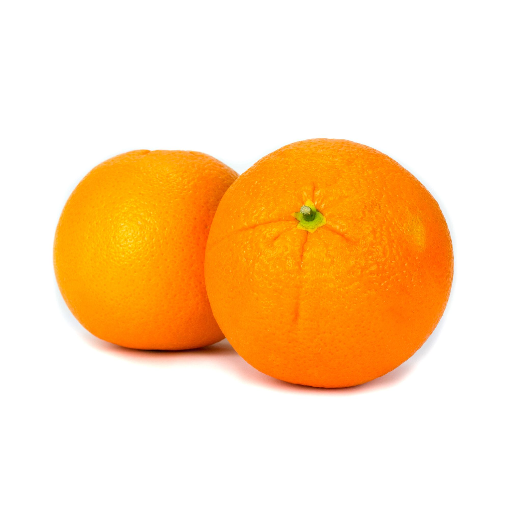
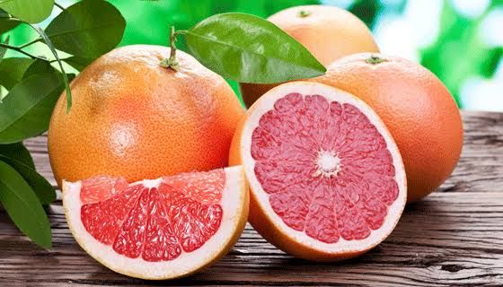
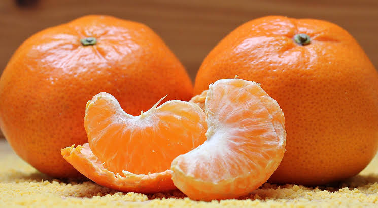
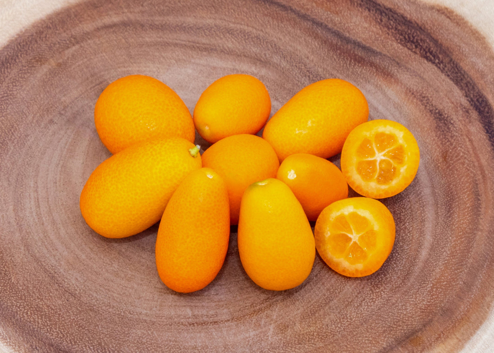
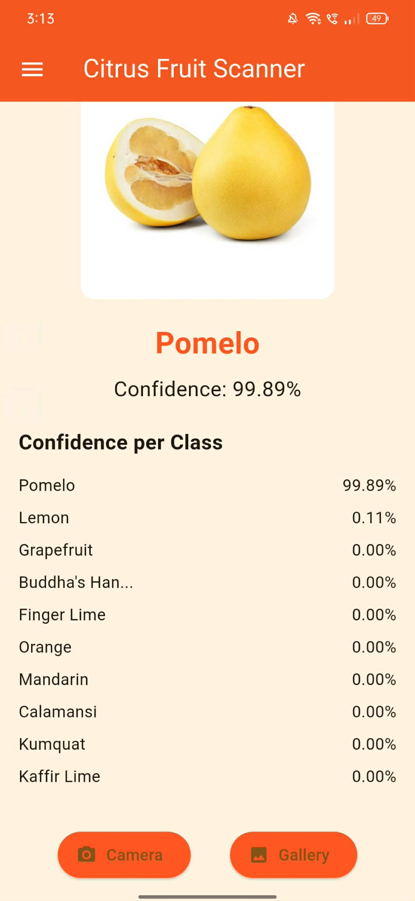

🍊 Citrus Fruit Classification Mobile Application  
  *An On-Device Basic Machine Learning Approach Using Flutter and Firebase*

  
  
  
  

  <em>
    A mobile-based intelligent system for real-time citrus fruit classification using on-device basic machine learning and cloud-based data analytics.
  </em>

---

👨‍🎓 Researcher / Developer
**Vergel Labarete**  
Bachelor of Science in Information Technology (Student)

🔗 **GitHub Repository:**  
https://github.com/Rukushi11/Labarete_CitrusFruit_Classification_FinalProject

---

🧠 Classification Categories

| No. | Citrus Fruit  | Class Description                                                                  | Sample Image                     |
| --: | ------------- | ---------------------------------------------------------------------------------- | -------------------------------- |
|   1 | Lemon         | Yellow citrus fruit with an oval shape and smooth to lightly textured peel         |            |
|   2 | Orange        | Round citrus fruit with bright orange skin and moderate surface texture            |           |
|   3 | Grapefruit    | Large citrus fruit with pale orange to pinkish rind and thick peel                 |      |
|   4 | Mandarin      | Small, flattened citrus fruit with loose, thin orange peel                         |        |
|   5 | Kaffir Lime   | Green citrus fruit with a highly bumpy and wrinkled rind                           |    |
|   6 | Calamansi     | Small citrus fruit, green to orange when ripe, commonly used in Philippine cuisine |        |
|   7 | Finger Lime   | Elongated, cylindrical citrus fruit with textured outer skin                       |   |
|   8 | Buddha's Hand | Bright yellow citrus fruit with finger-like segmented lobes                        |  |
|   9 | Pomelo        | Very large citrus fruit with thick rind and pale green to yellow skin              |           |
|  10 | Kumquat       | Small oval citrus fruit with smooth orange skin, typically eaten whole             |          |

---

 📱 Abstract

The **Citrus Fruit Classification Mobile Application** is a Flutter-based system designed to classify citrus fruits using images captured from a mobile device. The application integrates an **on-device basic machine learning model** to perform real-time inference without relying on constant internet connectivity.

Prediction results, including confidence scores and class probabilities, are stored in **Firebase Firestore**, enabling real-time analytics and historical scan tracking. This project demonstrates the practical integration of **mobile development**, **basic machine learning**, and **cloud-based data management** within a single end-to-end solution.

---

 🚀 System Features

 🔍 Image Acquisition and Classification
- Image capture via device camera  
- Image selection from device gallery  
- Fully automated classification process  
- Display of predicted class and confidence percentage  

---

 📊 Analytics and Visualization
- Bar chart representing total detection count per citrus type  
- Line chart displaying average confidence per fruit  
- Tabular analytics with real-time updates  
- Distinct color mapping per class for improved readability  

---

 🗂 Scan History Logs
- Chronological record of all scans  
- Displays:
  - Predicted citrus fruit  
  - Confidence score  
  - Timestamp  

---

 ☁ Firebase Cloud Integration
- All scan data stored in **Firestore**  
- Real-time synchronization for analytics and logs  
- Scalable and flat Firestore data structure:
Labarete_CitrusFruit
└── documentID
├── Classtype
├── confidence
├── scores
└── Time

---

 🧠 Machine Learning Model
- Executed entirely **on-device**  
- Outputs:
  - Predicted class label  
  - Confidence score  
  - Probability distribution across all classes  
- Integrated using a custom `CitrusClassifier` abstraction  

---

 📸 Application Screenshots

> *(Replace image filenames with your actual screenshots)*

 🏠 Home & Image Capture

### 🔍 Prediction Result

 📊 Analytics Dashboard

 🗂 Scan Logs

---

 🎯 Objectives of the Study

This project was developed to:

- Demonstrate the application of **machine learning in mobile platforms**
- Utilize **on-device inference** for real-time classification
- Implement **cloud-based analytics** using Firebase Firestore
- Design a clean and responsive **Flutter UI/UX**
- Integrate machine learning, mobile UI, and cloud storage into a unified system

---

 🧪 Proposed Enhancements

- Offline scan caching and synchronization  
- Exportable analytics (CSV format)  
- Comparative evaluation of model accuracy  
- Dark mode UI support  
- Web-based administrative analytics dashboard  

---

 📊 GitHub Statistics

  

  

---

 ⭐ Conclusion

The **Citrus Fruit Classification Mobile Application** serves as an academic demonstration of intelligent mobile systems, combining machine learning inference, real-time analytics, and cloud data storage. It is suitable for academic evaluation, capstone presentation, and portfolio showcasing of Flutter and applied machine learning skills.

---
